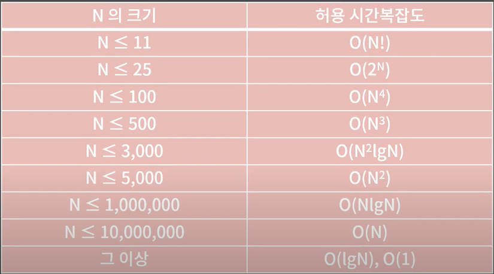
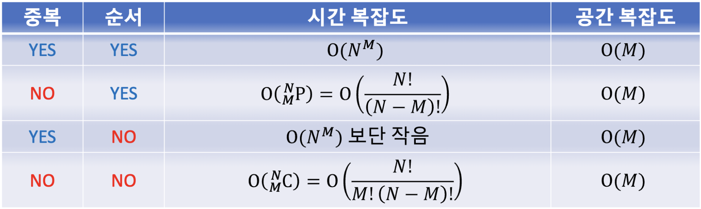

# 시간복잡도

- 1초 = 대략 1억개 (3~5억개)

## n의 크기에 따른 시간복잡도



---

## 로그

코테에는 밑이 2인 로그만 나온다. 로그는 해당 수 가 2의 몇 거듭제곱인지를 의미합니다. 아래의 로그만 알아도 무방합니다.

```
// 2를 몇번 곱해야하는지 계산하면 된다.
log2 = 1
log4 = 2
log8 = 3
log16 = 4
log32= 5
```

### 완전 탐색 시간복잡도

N개 중 중복을 허용해서(없이) M개를 순서 있게(앖게) 나열하기


